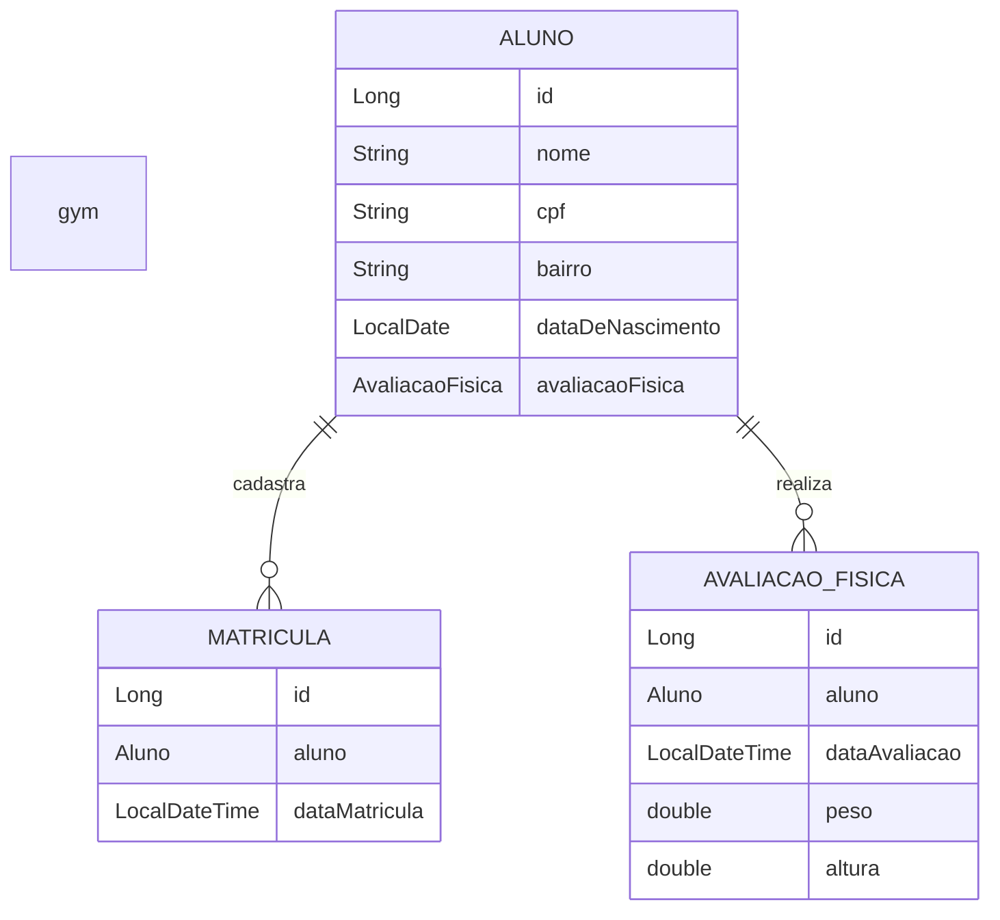

# CadimiaApp

```mermaid
erDiagram gym

ALUNO ||--o{ MATRICULA : cadastra
    ALUNO { 
        Long id
        String nome
        String cpf
        String bairro
        LocalDate dataDeNascimento
        AvaliacaoFisica avaliacaoFisica
}

ALUNO ||--o{ AVALIACAO_FISICA : realiza 
    AVALIACAO_FISICA { 
        Long id
        Aluno aluno
        LocalDateTime dataAvaliacao
        double peso
        double altura
 }
 
MATRICULA {
    Long id
    Aluno aluno
    LocalDateTime dataMatricula
}
```
