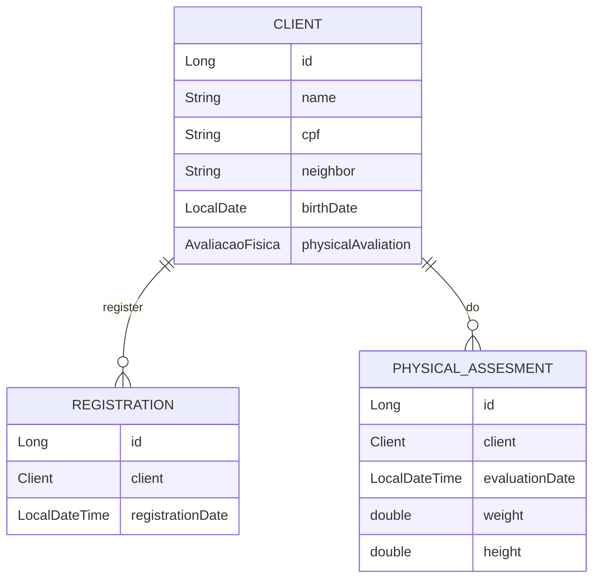

# CadimíaApp

---

ER DIAGRAM for the Gym App

---

```mermaid
erDiagram

CLIENT ||--o{ REGISTRATION : register
    CLIENT { 
        Long id
        String name
        String cpf
        String neighbor
        LocalDate birthDate
        AvaliacaoFisica physicalAvaliation
}

CLIENT ||--o{ PHYSICAL_ASSESMENT : do
    PHYSICAL_ASSESMENT { 
        Long id
        Client client
        LocalDateTime evaluationDate
        double weight
        double height
 }
 
REGISTRATION {
    Long id
    Client client
    LocalDateTime registrationDate
}
```
