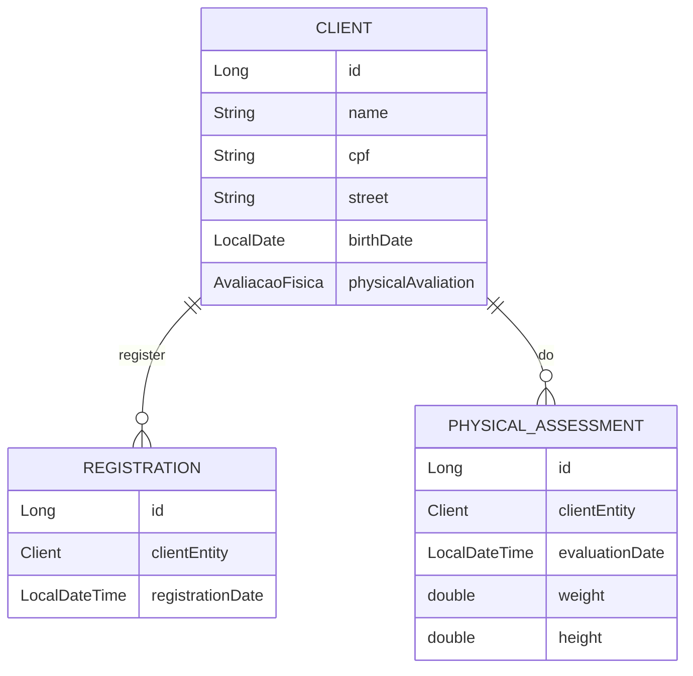

# CadimíaApp

## Presentation

This is a Java App to be used by gym establishments. It will let the user register a new clientEntity, organize physical assessments for this clientEntity and use the registration date to persist data.

---

ER DIAGRAM for the Gym App

---

## Back-end flow

## Used technologies

- Java

- Maven

- Spring Web

- Spring Data JPA

- PostgreSQL Driver

- Hibernate Validator

- Lombok
